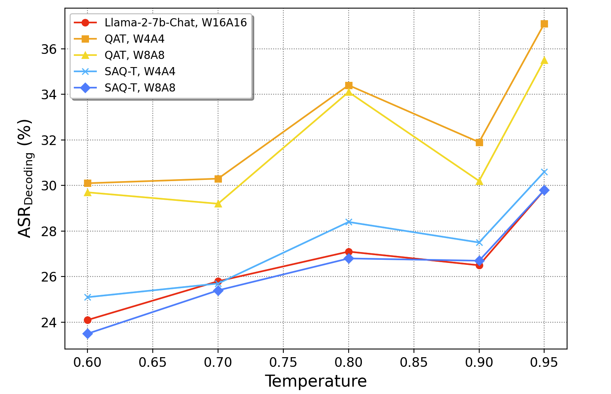
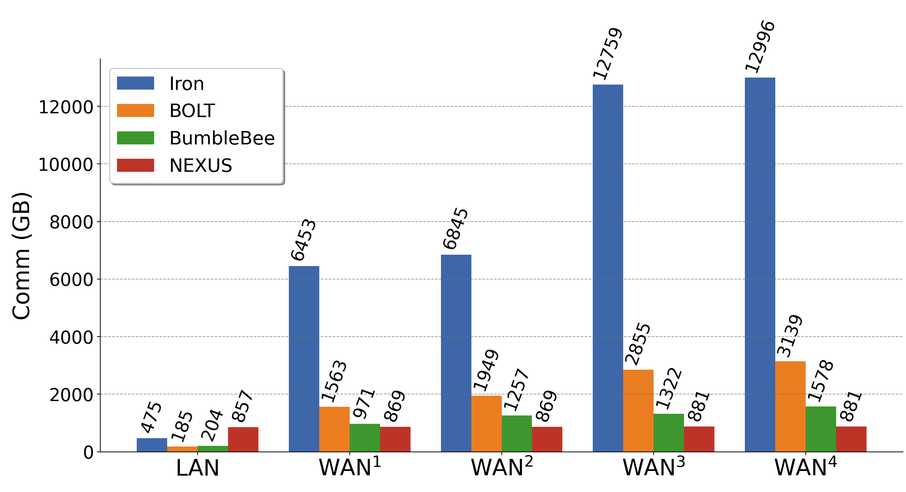
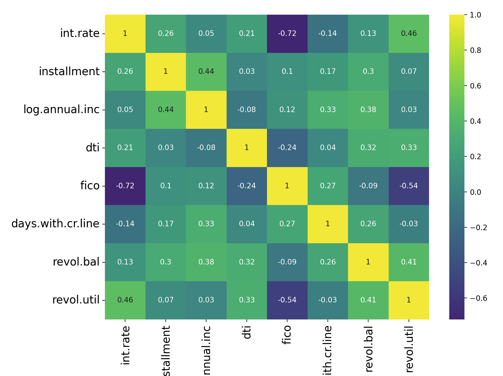
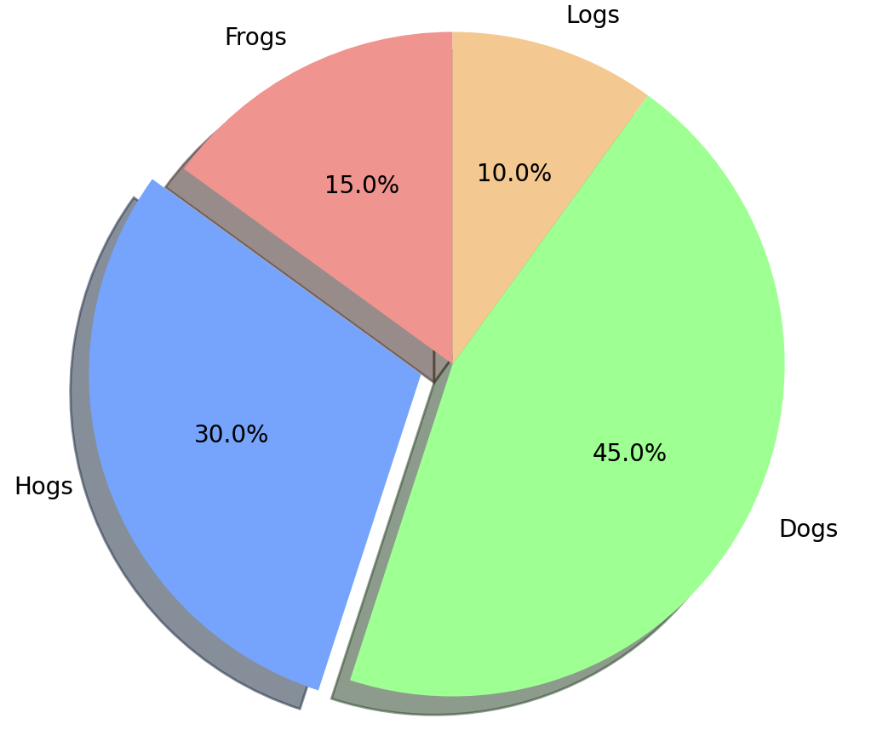
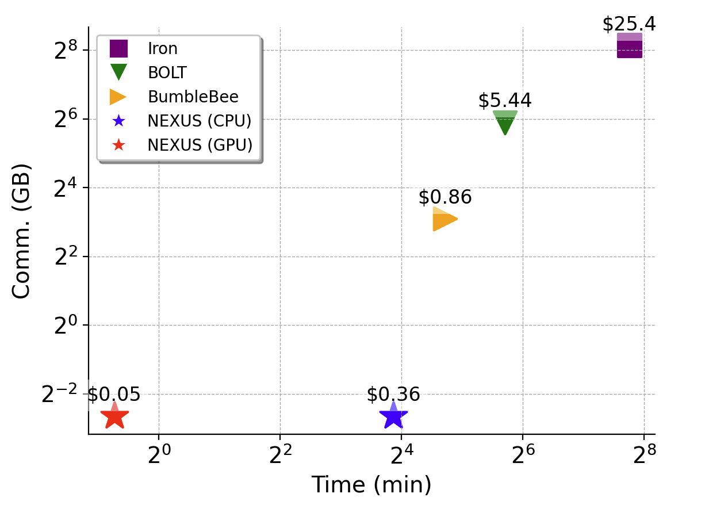

# Scripts for drawing figures in your paper

### 1. Line Chart
```
python3 line_chart_draw.py
```



### 2. Bar Chart
```
python3 bar_chart_draw.py
```


### 3. Heat Map
```
pip install seaborn
python3 heat_map_draw.py
```


### 4. Pie Chart
```
python3 pie_chart_draw.py
```


### 5. Dot Chart
```
python3 dot_chart_draw.py
```
